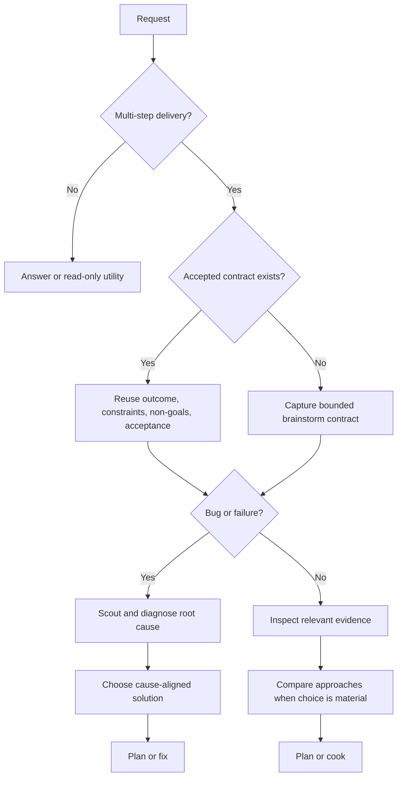

# Brainstorm

Turn incomplete intent into a bounded delivery contract. Stay honest about
evidence, trade-offs, and uncertainty without turning a clear request into a
ceremonial interview.

## Brainstorm contract

Every multi-step product, code, documentation, or maintainer delivery starts by
capturing:

- **Outcome:** the user-visible or operational end state.
- **Constraints:** safety, compatibility, time, technology, and ownership
  boundaries that shape the work.
- **Non-goals:** nearby work that this delivery will not absorb.
- **Acceptance criteria:** observable evidence that will prove completion.

An accepted design or plan satisfies the opening gate when it already contains
these fields. Reuse it and identify only material gaps; do not make the user
repeat settled decisions.

## Proportional behavior

- For a concrete request, summarize the four fields briefly and continue.
- Ask a concise question only when a missing answer would materially change the
  result, safety boundary, or public contract and cannot be discovered.
- Explicit autonomous execution may continue once the four fields are concrete;
  it does not require a routine approval pause.
- Direct answers and low-level read-only utilities do not require a design loop.
  If investigation turns into workspace mutation or delivery, satisfy the gate
  before that boundary.
- Separate target intent from current evidence. Inspect relevant repository or
  live state before claiming an approach is feasible.

## Bug routing

For bugs, start by framing the expected repaired behavior, constraints,
non-goals, and acceptance evidence. Do not propose fixes from the symptom.

1. Scout the affected path and capture the failing state.
2. Diagnose and prove the root cause.
3. Compare cause-aligned solutions only after diagnosis.
4. Use a full options discussion when multiple viable fixes or an architecture
   decision remain; otherwise record why the direct fix is sufficient.

This preserves brainstorm-first intent without allowing brainstorming to replace
root-cause analysis.

## Option exploration

When the work has a real design choice:

1. Inspect the smallest relevant source, docs, tests, and current plans.
2. State the confirmed constraints and any evidence gaps.
3. Present up to three viable approaches with meaningful trade-offs.
4. Recommend the smallest approach that satisfies the contract.
5. Resolve material disagreement before implementation begins.

Challenge assumptions with evidence. Apply YAGNI, KISS, and DRY in that order.
Do not invent extra components, migrations, or governance to make a design look
complete.

## Authoritative flow

The opening contract is always first for delivery. Detailed solution exploration
may occur later when diagnosis or inspection provides the evidence it needs.

## Handoff

Pass the four contract fields, chosen direction, evidence, and unresolved risks
to the next owning workflow:

- feature or documentation delivery: the installed plan skill, then `/ak:cook`;
- diagnosed bug: `/ak:fix`;
- exploration only: report the recommendation and stop.

Write a durable summary only when the decision must survive the session or feed
a plan. Use the repository's configured report location and naming convention;
do not create a report merely to satisfy the gate.

## Boundaries

- This skill shapes intent and choices; it does not implement the solution.
- Never claim current behavior from intent alone.
- Never expose secrets or unrelated private files during inspection.
- List unresolved questions last when any remain.

## Workflow position

**Typically precedes:** the installed plan skill or `/ak:cook`.

**Bug path:** opening intent frame -> scout and debug -> solution brainstorm when
needed -> `/ak:fix`.
