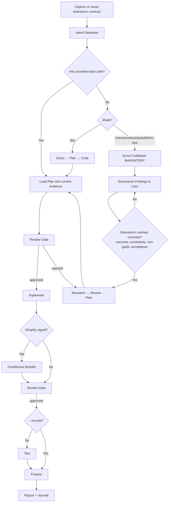

# Cook - Smart Feature Implementation

End-to-end implementation with automatic workflow detection.

**Principles:** YAGNI, KISS, DRY | Token efficiency | Concise reports

## Usage

```
/ak:cook <natural language task OR plan path>
```

**IMPORTANT:** If no flag is provided, the skill will use the `interactive` mode by default for the workflow.

**Optional flags to select the workflow mode:** 
- `--interactive`: Full workflow with user input (**default**)
- `--fast`: Skip research, scout→plan→code
- `--parallel`: Multi-agent execution
- `--no-test`: Skip testing step
- `--auto`: Auto-approve all steps

**Composable flags** (combine with any mode):
- `--tdd`: Tests-first per phase — write tests for current behavior before
  refactoring, then verify they still pass after the implementation step

**Example:**
```
/ak:cook "Add user authentication to the app" --fast
/ak:cook path/to/plan.md --auto
/ak:cook "Refactor auth middleware" --tdd
```

<HARD-GATE-BRAINSTORM-FIRST>
Before planning or implementation, capture the opening brainstorm contract:
outcome, constraints, non-goals, and observable acceptance criteria.

- If the input is an accepted plan or design, reuse those fields and identify
  only material gaps.
- If the input is a natural-language task, state the fields from the request and
  ask only about a missing decision that would change the result or safety.
- `--fast`, `--parallel`, and `--auto` change execution shape, not this gate.
- Route concrete bugs to `/ak:fix`; it frames intent first, then proves the root
  cause before selecting a solution.
</HARD-GATE-BRAINSTORM-FIRST>

<HARD-GATE>
Do NOT write implementation code until a plan exists and has been reviewed.
This applies regardless of task simplicity. "Simple" tasks are where unexamined assumptions waste the most time.
Exception: `--fast` mode skips research but still requires a plan step.
User override: If user explicitly says "just code it" or "skip planning", respect their instruction.
</HARD-GATE>

<HARD-GATE-SCOUT-FIRST>
After the opening brainstorm gate and before planning, scan the codebase.
Mandatory scout outputs:
1. Project type, language(s), framework(s)
2. Existing modules/files relevant to the task
3. Current patterns/conventions for similar features (so the implementation matches them)
4. Existing docs in `./docs/` and any in-flight plans in `./plans/` covering this area
5. Public APIs, schemas, contracts that the task could affect

State a concise codebase-context summary before asking any further questions.
Skip only when an accepted plan already contains current scout evidence.
</HARD-GATE-SCOUT-FIRST>

<HARD-GATE-EXACT-REQUIREMENTS>
Before producing a plan, the brainstorm contract must be concrete and scout
evidence must identify likely touchpoints and stable public contracts. Ask only
for a material requirement that neither the request, accepted plan, nor current
evidence resolves. Ground questions in discovered paths and behavior.
</HARD-GATE-EXACT-REQUIREMENTS>

<HARD-GATE-NO-SIDE-EFFECTS>
Implementation is NOT done until verified to be side-effect-free. Code-review and test gates MUST prove:

1. New behavior matches every acceptance criterion above.
2. All tests pass — including tests in modules that share files/contracts with the change.
3. No existing business logic / workflow regression: explicitly walk each touchpoint and any caller of changed functions.
4. No new lint/type/build errors anywhere in the repo.
5. Public contracts unchanged unless intentional and called out (function signatures, exported types, API responses, DB schemas, env vars, config keys).

User override: If user invoked `--no-test`, item 2 is downgraded to a warning. Surface the unverified-tests risk in the finalize `ask_user capability` so the user accepts the trade-off rather than having it silently chosen. Items 1, 3, 4, 5 remain enforceable via the mandatory `code-reviewer` subagent.

If review/testing reveals a side effect, regression, or broken workflow, STOP. Use `ask_user capability` to present:
- What broke (file, test, workflow, user-facing behavior)
- Why this implementation caused it (1-line cause)
- 2-4 concrete options for the user to choose, e.g.:
  - "Revert this slice and re-plan with stricter scope"
  - "Keep the implementation and update <dependents> to match the new contract"
  - "Add a compatibility shim at <boundary> so old callers keep working"
  - "Accept the regression — old behavior was unintended/buggy"

Let the user decide. Do not silently patch around regressions.
</HARD-GATE-NO-SIDE-EFFECTS>

## Anti-Rationalization

| Thought | Reality |
|---------|---------|
| "This is too simple to plan" | Simple tasks have hidden complexity. Plan takes 30 seconds. |
| "I already know how to do this" | Knowing ≠ planning. Write it down. |
| "Let me just start coding" | Undisciplined action wastes tokens. Plan first. |
| "The user wants speed" | Fastest path = plan → implement → done. Not: implement → debug → rewrite. |
| "I'll plan as I go" | That's not planning, that's hoping. |
| "Just this once" | Every skip is "just this once." No exceptions. |

## Smart Intent Detection

| Input Pattern | Detected Mode | Behavior |
|---------------|---------------|----------|
| Path to `plan.md` or `phase-*.md` | code | Execute existing plan |
| Contains "fast", "quick" | fast | Skip research, scout→plan→code |
| Contains "trust me", "auto" | auto | Auto-approve all steps |
| Lists 3+ features OR "parallel" | parallel | Multi-agent execution |
| Contains "no test", "skip test" | no-test | Skip testing step |
| Default | interactive | Full workflow with user input |

See `references/intent-detection.md` for detection logic.

If the task needs a cross-skill workflow sequence decision after intent
detection, load `references/workflow-routing.md`.

## Process Flow (Authoritative)



**This diagram is the authoritative workflow.** Prose sections below provide detail for each node. If prose conflicts with this flow, follow the diagram.

## Workflow Overview

```
[Brainstorm Contract] → [Intent Detection] → [Inspect/Research?] → [Review] → [Plan] → [Review] → [Implement] → [Conditional Simplify?] → [Review] → [Test?] → [Review] → [Finalize]
```

**Default (non-auto):** Stops at `[Review]` gates for human approval before each major step.
**Auto mode (`--auto`):** Skips human review gates, implements all phases continuously.
**Progress tracking:** Discover the live task-management surface at runtime and
use it when available. Otherwise, update the active plan directly. Plan files
are the durable source of truth; do not infer support from cached tool lists.

| Mode | Research | Testing | Review Gates | Phase Progression |
|------|----------|---------|--------------|-------------------|
| interactive | ✓ | ✓ | **User approval at each step** | One at a time |
| auto | ✓ | ✓ | Per `references/review-cycle.md` | All at once (no stops) |
| fast | ✗ | ✓ | **User approval at each step** | One at a time |
| parallel | Optional | ✓ | **User approval at each step** | Parallel groups |
| no-test | ✓ | ✗ | **User approval at each step** | One at a time |
| code | ✗ | ✓ | **User approval at each step** | Per plan |

## Step Output Format

```
✓ Step [N]: [Brief status] - [Key metrics]
```

## Blocking Gates (Non-Auto Mode)

Human review required at these checkpoints (skipped with `--auto`):
- **Post-Research:** Review findings before planning
- **Post-Plan:** Approve plan before implementation
- **Post-Implementation:** Approve code before testing
- **Post-Testing:** 100% pass + approve before finalize

**Always enforced (all modes):**
- **Testing:** 100% pass required (unless no-test mode)
- **Code Review (MANDATORY):** Spawn `code-reviewer` subagent with explicit checks:
  (a) every acceptance criterion met,
  (b) no regression to business logic in touchpoints/blast-radius,
  (c) no breaking changes to public contracts (signatures, schemas, APIs, env vars) unless called out,
  (d) follows existing patterns from scout,
  (e) no new lint/type/build errors anywhere.
  Pass scout summary + acceptance criteria as context. If reviewer flags side effects → trigger HARD-GATE-NO-SIDE-EFFECTS (`ask_user capability` with 2-4 options).
  Then: user approval or the auto-mode decision in `references/review-cycle.md`.
- **Finalize (MANDATORY - never skip):**
  1. **Activate `the engineer project-management skill` skill (MANDATORY)** → run full plan sync-back across ALL `phase-XX-*.md` (not only current phase), update `plan.md` status/progress, refresh runtime tracking when available, generate progress report
  2. Evaluate docs impact; use `docs-manager` only for affected routed authority surfaces
  3. After sync-back verification, reflect completion in the live task-management surface when available
  4. Ask user if they want to commit via `git-manager` subagent
  5. Run `/ak:journal` to write a concise technical journal entry upon completion

## Required Subagents (MANDATORY)

| Phase | Subagent | Requirement |
|-------|----------|-------------|
| Research | `researcher` | Optional in fast/code |
| Scout | `ak:scout` | Optional in code |
| Plan | `planner` | Optional in code |
| UI Work | `ui-ux-designer` | If frontend work |
| Testing | `tester`, `debugger` | **MUST** spawn |
| Review | `code-reviewer` | **MUST** spawn |
| Finalize | `the engineer project-management skill`; conditional `docs-manager`; configured git workflow | Project sync and docs-impact decision are mandatory |

**CRITICAL ENFORCEMENT:**
- Steps 4, 5, 6 **MUST** use the live delegation capability to spawn subagents
- DO NOT implement testing, review, or finalization yourself - DELEGATE
- If workflow ends without the required delegations, it is INCOMPLETE
- Pattern: `delegate_agent capability(subagent_type="[type]", prompt="[task]", description="[brief]")`

## References

- `references/intent-detection.md` - Detection rules and routing logic
- `references/workflow-routing.md` - Cross-skill sequence routing for ambiguous workflows
- `references/workflow-steps.md` - Detailed step definitions for all modes
- `references/review-cycle.md` - Interactive and auto review processes
- `references/subagent-patterns.md` - Subagent invocation patterns

## Workflow Position

**Typically follows:** `the engineer plan skill` (execute a plan), `/ak:brainstorm` (implement agreed solution)
**Typically precedes:** `the installed code-review skill` (review after implementation), `the installed test skill` (validate changes)
**Related:** `/ak:fix` (alternative for bug fixes), `the engineer plan skill` (create plan before cooking)
